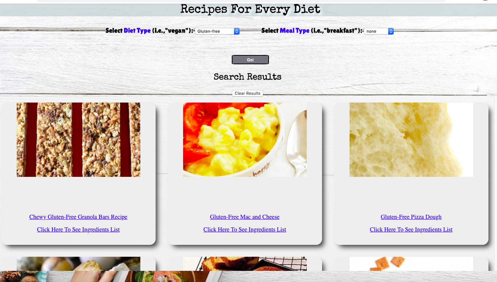
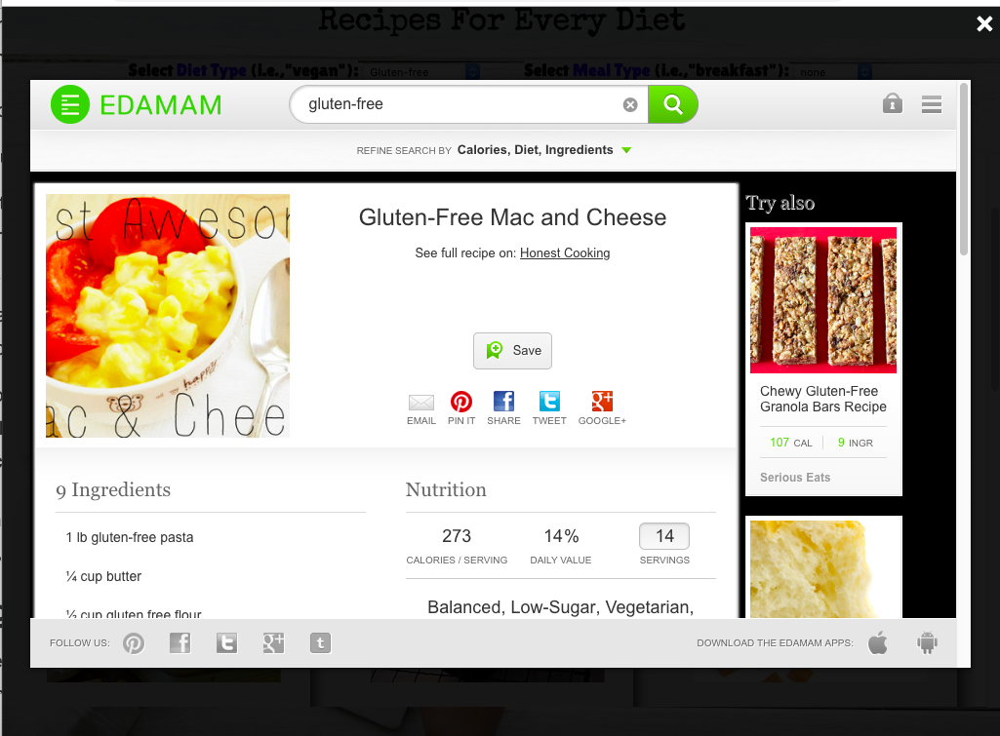
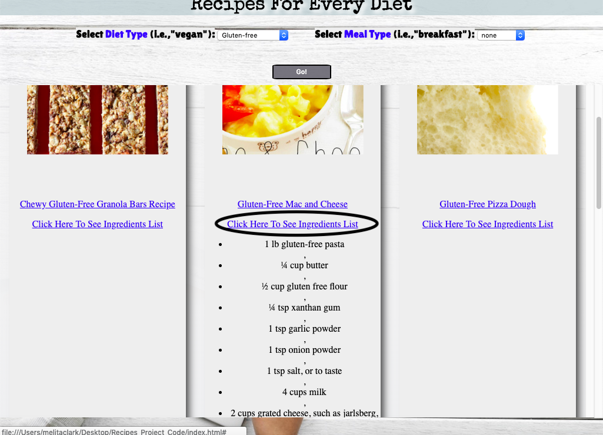

A-Recipe-For-Every-Diet
---------------------------

Link: https://melitaclark.github.io/A-Recipe-For-Every-Diet/

Application Summary: 
In a world which is ever increasing in dietary diversity and decreasing in spare time, one may desire a quick and easy generator of customized meal ideas; this is the goal of the "A-Recipe-For-Every-Diet" app. 

This app allows the user to select their specific diet type from the drop-down menu. The user may also choose to select a 
meal type (i.e., breakfast, lunch, dinner). Once the results appear, the user can browse through, select a recipe of choice
and either, click on the first anchor link which will open a light box to the acutal sites details about the recipe or click on the second hyperlink to reveal a drop-down for the recipes ingredients list. 

-----------------------------
Let's search for gluten-free diet options: 

--------------------------------
Let's take a look at the full details of the recipe page: 

                                          

---------------------------------
Or, maybe we just what a list of necessary ingredients: 

                                          

-----------------------------------

Technology used: 
- HTML
- CSS
- JavaScript
- JQuery
